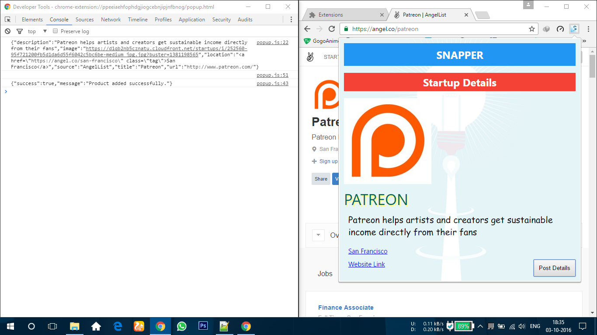

# Snapper
This is a Chrome extension plugin used to get info snippets about startups on some particular websites.
Currently it works well on  https://angel.co/*

## Screenshot

## Screenshot

## Screenshot

